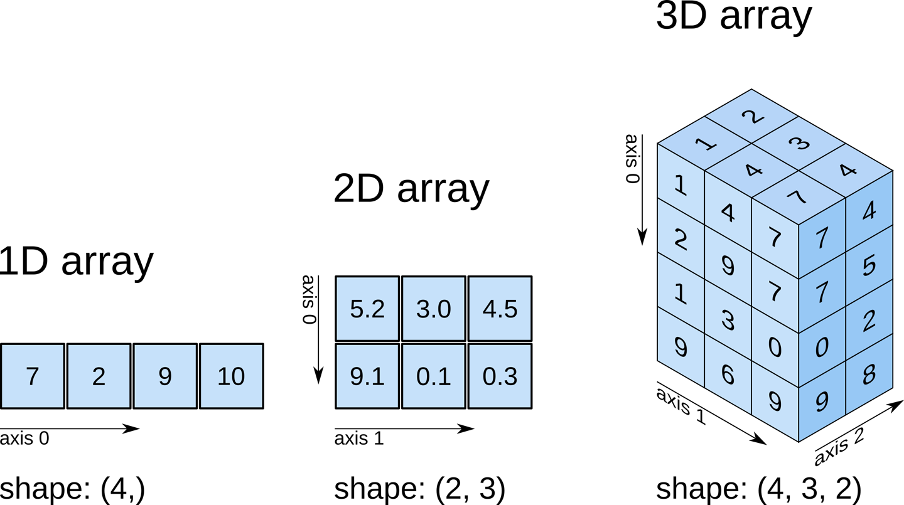

# numpy 学习笔记

### numpy 是竖的！，默认竖直排列 order='C'行优先

```
import numpy as np

a = np.array([[1.1],[2.2],[3.3]],dtype = np.float64)
==
a = np.array([[1.1]
             ,[2.2]
             ,[3.3]],dtype = np.float64)

a.shape=  #
(3, 1)

a.size=   # 一共有三个数
3

a.ndim=   # 多少维度
2
```

### 精度类型

类型 解释
bool 布尔类型，1 个字节，值为 True 或 False。
int 整数类型，通常为 int64 或 int32。
intc 与 C 里的 int 相同，通常为 int32 或 int64。
intp 用于索引，通常为 int32 或 int64。
int8 字节（从 -128 到 127）
int16 整数（从 -32768 到 32767）
int32 整数（从 -2147483648 到 2147483647）
int64 整数（从 -9223372036854775808 到 9223372036854775807）
uint8 无符号整数（从 0 到 255）
uint16 无符号整数（从 0 到 65535）
uint32 无符号整数（从 0 到 4294967295）
uint64 无符号整数（从 0 到 18446744073709551615）
float float64 的简写。
float16 半精度浮点，5 位指数，10 位尾数
float32 单精度浮点，8 位指数，23 位尾数
float64 双精度浮点，11 位指数，52 位尾数
complex complex128 的简写。
complex64 复数，由两个 32 位浮点表示。
complex128 复数，由两个 64 位浮点表示。

```
# 转精度   .astpype()
# 转为 int
a.astype(int)
```

### ndarray Numpy 的数组核心

1.对于 python
在 Python 内建对象中，数组有三种形式：

列表：[1, 2, 3]
元组：(1, 2, 3, 4, 5)
字典：{A:1, B:2}

2.对于 ndarray
NumPy 中，ndarray 类具有六个参数，它们分别为：

shape：数组的形状。
dtype：数据类型。
buffer：对象暴露缓冲区接口。
offset：数组数据的偏移量。
strides：数据步长。
order：{'C'，'F'}，以行或列为主排列顺序。

### Numpy ndarray 创建数组

5 种途径创建数组，它们分别是：

从 Python 数组结构列表，元组等转换。
使用 np.arange、np.ones、np.zeros 等 NumPy 原生方法。
从存储空间读取数组。
通过使用字符串或缓冲区从原始字节创建数组。
使用特殊函数，如 random。

```
一：array 方法转化
numpy.array(object, dtype=None, copy=True, order=None, subok=False, ndmin=0)
**
object：列表、元组等。
dtype：数据类型。如果未给出，则类型为被保存对象所需的最小类型。
**
copy：布尔类型，默认 True，表示复制对象。
order：顺序。
subok：布尔类型，表示子类是否被传递。
ndmin：生成的数组应具有的最小维数。

np.array([[1, 2, 3], [4, 5, 6]]) shape =（2，3）
np.array([(1, 2), (3, 4), (5, 6)]) shape =（3，2）
```

```
二：arange 方法创建
numpy.arange(start, stop, step, dtype=None)
注意：区间 [开始， 停止)，这是一个左闭右开

# 在区间 [3, 7) 中以 0.5 为步长新建数组
a = np.arange(3, 7, 0.5, dtype='float32')
array([3. , 3.5, 4. , 4.5, 5. , 5.5, 6. , 6.5], dtype=float32)
a.shape = (8，)
```

```
三：linspace 方法创建 区间内均匀生成数组 默认是左闭右开
numpy.linspace(start, stop, num=50, endpoint=True, retstep=False, dtype=None)
**
start：序列的起始值。
stop：序列的结束值。
num：生成的样本数。默认值为 50。
endpoint：布尔值，如果为真，则最后一个样本包含在序列内。
**
retstep：布尔值，如果为真，返回间距。
dtype：数组的类型。

np.linspace(0, 10, 10, endpoint=True)
dtype=float32)
array([ 0.        ,  1.11111111,  2.22222222,  3.33333333,  4.44444444,
        5.55555556,  6.66666667,  7.77777778,  8.88888889, 10.        ])

np.linspace(0, 10, 10, endpoint=False)
array([0., 1., 2., 3., 4., 5., 6., 7., 8., 9.])
```

```
四：
ones, zeros可以是多维的，shape自定义
numpy.ones(shape, dtype=None, order='C')
np.ones((2, 3))

numpy.zeros(shape, dtype=None, order='C')
np.zeros((2, 3))

注意：np.eye仅是一个二维的
numpy.eye 用于创建一个二维数组，其特点是 k 对角线上的值为 1，其余值全部为 0。

np.eye(5, 4, 3)   由于3>0，第3对角线为1
array([[0., 0., 0., 1.],
       [0., 0., 0., 0.],
       [0., 0., 0., 0.],
       [0., 0., 0., 0.],
       [0., 0., 0., 0.]])
```

```
五：已知数据创建 较为复杂
frombuffer（buffer）：将缓冲区转换为 1 维数组。
fromfile（file，dtype，count，sep）：从文本或二进制文件中构建多维数组。
fromfunction（function，shape）：通过函数返回值来创建多维数组。
fromiter（iterable，dtype，count）：从可迭代对象创建 1 维数组。
fromstring（string，dtype，count，sep）：从字符串中创建 1 维数组。

np.fromfunction(lambda a, b: a + b, (5, 4))
array([[0., 1., 2., 3.],
       [1., 2., 3., 4.],
       [2., 3., 4., 5.],
       [3., 4., 5., 6.],
       [4., 5., 6., 7.]])

```

### Numpy ndarray 数组操作

```
a = np.array([[1, 2, 3], [4, 5, 6], [7, 8, 9]])
a  # 查看 a 的值
array([[1, 2, 3],
       [4, 5, 6],
       [7, 8, 9]])
```

#### 转置: T or transpose()

```
a.T
or
a.transpose()
array([[1, 4, 7],
       [2, 5, 8],
       [3, 6, 9]])
```

#### dtype 查看数据类型

略

#### 虚部.imag 实部.real

```
a.imag

a.real
```

#### size 查看元素个数

略

#### 字节数占用查看

```
公式：
a.nbytes = a.size * a.itemsize

ndarray.itemsize输出一个数组元素的字节数。
a.itemsize
8
a.nbytes输出数组的元素总字节数。
72
```

#### Numpy ndarray 数组形状与维度



```
one = np.array([7, 2, 9, 10])
two = np.array([[5.2, 3.0, 4.5],
                [9.1, 0.1, 0.3]])
three = np.array([[[1, 1], [1, 1], [1, 1]],
                  [[1, 1], [1, 1], [1, 1]],
                  [[1, 1], [1, 1], [1, 1]],
                  [[1, 1], [1, 1], [1, 1]]])

one.shape, two.shape, three.shape
((4,), (2, 3), (4, 3, 2))  2是因为[1, 1].shape = (2,)
```

#### 重设形状 reshape

```
numpy.reshape(a, newshape)

np.arange(10).reshape((5, 2))
array([[0, 1],
       [2, 3],
       [4, 5],
       [6, 7],
       [8, 9]])
```

#### 数组展开 ravel (从最小维度横行读取)

```
numpy.ravel(a, order='C')  行优先，按照行顺次读取

# 顺序的三维矩阵 (3x3x3)
sequential_3d_matrix = [
    [
        [1, 2, 3],
        [4, 5, 6],
        [7, 8, 9]
    ],
    [
        [10, 11, 12],
        [13, 14, 15],
        [16, 17, 18]
    ],
    [
        [19, 20, 21],
        [22, 23, 24],
        [25, 26, 27]
    ]
]
b= np.array(sequential_3d_matrix)
array([[[ 1,  2,  3],
        [ 4,  5,  6],
        [ 7,  8,  9]],

       [[10, 11, 12],
        [13, 14, 15],
        [16, 17, 18]],

       [[19, 20, 21],
        [22, 23, 24],
        [25, 26, 27]]])
b.ravel()
array([ 1,  2,  3,  4,  5,  6,  7,  8,  9, 10, 11, 12, 13, 14, 15, 16, 17,
       18, 19, 20, 21, 22, 23, 24, 25, 26, 27])
```

#### 轴移动 轴交换

```
numpy.moveaxis(a, source, destination)
numpy.swapaxes(a, axis1, axis2)

a = np.ones((1, 2, 3))
np.moveaxis(a, 0, -1)

a.shape, np.moveaxis(a, 0, -1).shape
((1, 2, 3), (2, 3, 1))

numpy.swapaxes(a, axis1, axis2)

a = np.ones((1, 4, 3))
np.swapaxes(a, 0, 2)

a.shape,np.swapaxes(a, 0, 2).shape
((1, 4, 3), (3, 4, 1))
```

#### ndarray 数组之间的操作 concatenate、stack

```
numpy.concatenate((a1, a2, ...), axis=0)
stack(arrays，axis)

a = np.array([[1, 2], [3, 4], [5, 6]])
b = np.array([[7, 8], [9, 10]])
c = np.array([[11, 12]])

np.concatenate((a, b, c), axis=0)
array([[ 1,  2],
       [ 3,  4],
       [ 5,  6],
       [ 7,  8],
       [ 9, 10],
       [11, 12]])

a = np.array([[1, 2], [3, 4], [5, 6]])
b = np.array([[7, 8, 9]])

np.concatenate((a, b.T), axis=1)
array([[1, 2, 7],
       [3, 4, 8],
       [5, 6, 9]])

a = np.array([1, 2, 3])
b = np.array([4, 5, 6])

np.stack((a, b))
==
np.array([[1, 2, 3],
       [4, 5, 6]])

array([[1, 2, 3],
       [4, 5, 6]])

np.stack((a, b), axis=-1)
array([[1, 4],
       [2, 5],
       [3, 6]])
```

#### 数组分割 split 划分为几个数组 dsplit、hsplit、vsplit 深度 水平 垂直

```
split(ary，indices_or_sections，axis)

a = np.arange(10)
np.split(a, 5)
[array([0, 1]), array([2, 3]), array([4, 5]), array([6, 7]), array([8, 9])]

a = np.arange(10).reshape(2, 5)
np.split(a, 2)
[array([[0, 1, 2, 3, 4]]), array([[5, 6, 7, 8, 9]])]
```

#### 数组删除 delete

```
delete(arr，obj，axis)

a = np.arange(12).reshape(3, 4)
print(a)
print(np.delete(a, 2, 1))

[[ 0  1  2  3]
 [ 4  5  6  7]
 [ 8  9 10 11]]
[[ 0  1  3]
 [ 4  5  7]
 [ 8  9 11]]

```

#### 数组插入 insert 在某个 axis 的 obj 之前插入 values

```
insert(arr，obj，values，axis)

a = np.arange(12).reshape(3, 4)
b = np.arange(4)

np.insert(a, 2, b, 0)
[[ 0  1  2  3]
 [ 4  5  6  7]
 [ 8  9 10 11]]

```

#### 数组追加 append 插入到 axis 的末尾，并返回一个一维的数组

```
append(arr，values，axis)

a = np.arange(6).reshape(2, 3)
b = np.arange(3)

np.append(a, b)

array([0, 1, 2, 3, 4, 5, 0, 1, 2])
```

#### 数组尺寸重设 resize

```
resize(a，new_shape)

区别:在于对原数组的影响。reshape 在改变形状时，不会影响原数组，相当于对原数组做了一份拷贝。而 resize 则是对原数组执行操作。

a = np.arange(10)
a.resize(2, 5)
a
```

#### 随机数生成 np.random

```
可以选择分布，后续需要时学

loc(float)：此概率分布的均值（对应着整个分布的中心centre
scale(float)：此概率分布的标准差（对应于分布的宽度，scale越大，图形越矮胖；scale越小，图形越瘦高）
size(int or tuple of ints)：输出的shape，默认为None，只输出一个值

numpy.random.beta(a，b，size)：从 Beta 分布中生成随机数。
numpy.random.binomial(n, p, size)：从二项分布中生成随机数。
numpy.random.chisquare(df，size)：从卡方分布中生成随机数。
numpy.random.dirichlet(alpha，size)：从 Dirichlet 分布中生成随机数。
numpy.random.exponential(scale，size)：从指数分布中生成随机数。
numpy.random.f(dfnum，dfden，size)：从 F 分布中生成随机数。
numpy.random.gamma(shape，scale，size)：从 Gamma 分布中生成随机数。
numpy.random.geometric(p，size)：从几何分布中生成随机数。
numpy.random.gumbel(loc，scale，size)：从 Gumbel 分布中生成随机数。
numpy.random.hypergeometric(ngood, nbad, nsample, size)：从超几何分布中生成随机数。
numpy.random.laplace(loc，scale，size)：从拉普拉斯双指数分布中生成随机数。
numpy.random.logistic(loc，scale，size)：从逻辑分布中生成随机数。
numpy.random.lognormal(mean，sigma，size)：从对数正态分布中生成随机数。
numpy.random.logseries(p，size)：从对数系列分布中生成随机数。
numpy.random.multinomial(n，pvals，size)：从多项分布中生成随机数。
numpy.random.multivariate_normal(mean, cov, size)：从多变量正态分布绘制随机样本。
numpy.random.negative_binomial(n, p, size)：从负二项分布中生成随机数。
numpy.random.noncentral_chisquare(df，nonc，size)：从非中心卡方分布中生成随机数。
numpy.random.noncentral_f(dfnum, dfden, nonc, size)：从非中心 F 分布中抽取样本。
numpy.random.normal(loc，scale，size)：从正态分布绘制随机样本。
numpy.random.pareto(a，size)：从具有指定形状的 Pareto II 或 Lomax 分布中生成随机数。
numpy.random.poisson(lam，size)：从泊松分布中生成随机数。
numpy.random.power(a，size)：从具有正指数 a-1 的功率分布中在 0，1 中生成随机数。
numpy.random.rayleigh(scale，size)：从瑞利分布中生成随机数。
numpy.random.standard_cauchy(size)：从标准 Cauchy 分布中生成随机数。
numpy.random.standard_exponential(size)：从标准指数分布中生成随机数。
numpy.random.standard_gamma(shape，size)：从标准 Gamma 分布中生成随机数。
numpy.random.standard_normal(size)：从标准正态分布中生成随机数。
numpy.random.standard_t(df，size)：从具有 df 自由度的标准学生 t 分布中生成随机数。
numpy.random.triangular(left，mode，right，size)：从三角分布中生成随机数。
numpy.random.uniform(low，high，size)：从均匀分布中生成随机数。
numpy.random.vonmises(mu，kappa，size)：从 von Mises 分布中生成随机数。
numpy.random.wald(mean，scale，size)：从 Wald 或反高斯分布中生成随机数。
numpy.random.weibull(a，size)：从威布尔分布中生成随机数。
numpy.random.zipf(a，size)：从 Zipf 分布中生成随机数。

```

### Numpy 中的 array 与 matrix

ndarray 是 NumPy 的核心数据结构，适用于通用数值计算，支持任意维度的数组。
matrix 是 ndarray 的子类，适用于矩阵计算，只支持 2 维数组。

```
a = np.arange(4).reshape(2, 2)
np.asmatrix(a)  # 将二维数组转化为矩阵类型
matrix([[0, 1],
        [2, 3]])
```

### Numpy 数学函数

#### 函数

[函数](docs\fun_numpy.md)

#### 数组索引与切片

```
ndarray [] 放入索引值 输出对应值
a = np.arange(20).reshape(4, 5)
a

array([[ 0,  1,  2,  3,  4],
       [ 5,  6,  7,  8,  9],
       [10, 11, 12, 13, 14],
       [15, 16, 17, 18, 19]])

a[1, 2]
7
a[[1, 2], [2, 1]] 取出多个
array([ 7, 11])

ndarray 切片
Ndarray[start:stop:step]

a = np.arange(10)
a

a[:5]
0~4
a[5:10]
5~9

a = np.arange(20).reshape(4, 5)
a
array([[ 0,  1,  2,  3,  4],
       [ 5,  6,  7,  8,  9],
       [10, 11, 12, 13, 14],
       [15, 16, 17, 18, 19]])
a[0:3, 2:4]  用逗号分隔开多个维度
array([[ 2,  3],
       [ 7,  8],
       [12, 13]])

a[:, ::2]  在第二个维度上，每隔两个取一个，偶数列
array([[ 0,  2,  4],
       [ 5,  7,  9],
       [10, 12, 14],
       [15, 17, 19]])

a = a.tolist()  # 转化为列表
a
[[0, 1, 2, 3, 4], [5, 6, 7, 8, 9], [10, 11, 12, 13, 14], [15, 16, 17, 18, 19]]
a[1][2]
7
```

#### 排序，搜索，计数

```
numpy.sort(a, axis=-1, kind='quicksort', order=None)  默认是最后一个轴

a：数组。
axis：要排序的轴。如果为 None，则在排序之前将数组铺平。默认值为 -1，沿最后一个轴排序。
kind：{'quicksort'，'mergesort'，'heapsort'}，排序算法。默认值为 quicksort。

a = np.random.rand(20).reshape(4, 5)
a
array([[0.86466177, 0.78737205, 0.64793692, 0.85930935, 0.13001785],
       [0.99056799, 0.5139694 , 0.84390133, 0.84590203, 0.62641438],
       [0.86421196, 0.28414089, 0.10180346, 0.43736815, 0.86430383],
       [0.12906996, 0.04126781, 0.91302401, 0.13743933, 0.02444972]])
np.sort(a)
array([[0.13001785, 0.64793692, 0.78737205, 0.85930935, 0.86466177],
       [0.5139694 , 0.62641438, 0.84390133, 0.84590203, 0.99056799],
       [0.10180346, 0.28414089, 0.43736815, 0.86421196, 0.86430383],
       [0.02444972, 0.04126781, 0.12906996, 0.13743933, 0.91302401]])

numpy.lexsort(keys ,axis)：使用多个键进行间接排序。
numpy.argsort(a ,axis,kind,order)：沿给定轴执行间接排序。
numpy.msort(a)：沿第 1 个轴排序。
numpy.sort_complex(a)：针对复数排序。
```

```
搜索，计数
argmax(a ,axis,out)：返回数组中指定轴的最大值的索引。
nanargmax(a ,axis)：返回数组中指定轴的最大值的索引，忽略 NaN。
argmin(a ,axis,out)：返回数组中指定轴的最小值的索引。
nanargmin(a ,axis)：返回数组中指定轴的最小值的索引，忽略 NaN。
argwhere(a)：返回数组中非 0 元素的索引，按元素分组。
nonzero(a)：返回数组中非 0 元素的索引。
flatnonzero(a)：返回数组中非 0 元素的索引，并铺平。
where(条件,x,y)：根据指定条件，从指定行、列返回元素。
searchsorted(a,v ,side,sorter)：查找要插入元素以维持顺序的索引。
extract(condition,arr)：返回满足某些条件的数组的元素。
count_nonzero(a)：计算数组中非 0 元素的数量。

```
