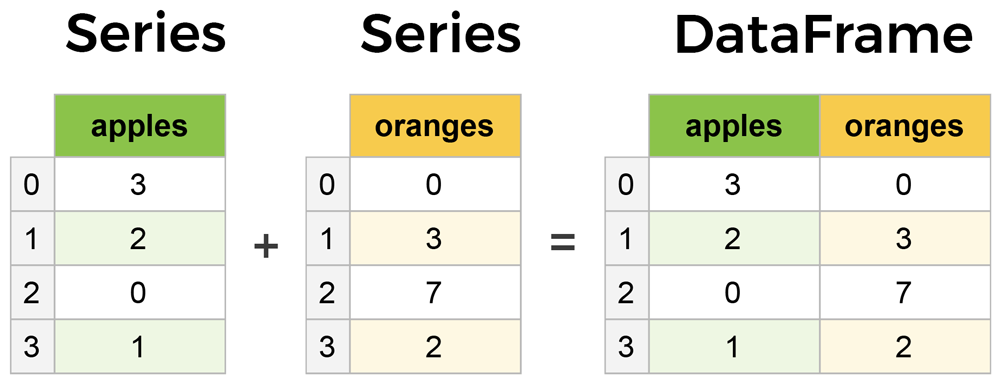
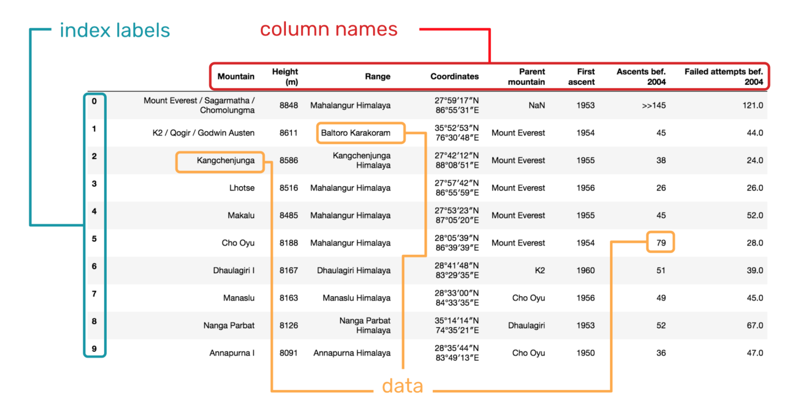

# Pandas 学习笔记

Pandas 是非常著名的开源数据处理库，其基于 NumPy 开发，该工具是 Scipy 生态中为了解决数据分析任务而设计。Pandas 纳入了大量库和一些标准的数据模型，提供了高效地操作大型数据集所需的函数和方法。

特有的数据结构是 Pandas 的优势和核心。简单来讲，我们可以将任意格式的数据转换为 Pandas 的数据类型，并使用 Pandas 提供的一系列方法进行转换、操作，最终得到我们期望的结果。

所以，我们首先需要了解并熟悉 Pandas 支持的数据类型。

Pandas 的数据类型主要有以下几种，它们分别是：Series（一维数组），DataFrame（二维数组），Panel（三维数组），Panel4D（四维数组），PanelND（更多维数组）。其中 Series 和 DataFrame 应用的最为广泛，几乎占据了使用频率 90% 以上。

## Series 一维数据结构
Series 是 Pandas 中最基本的一维数组形式。其可以储存整数、浮点数、字符串等类型的数据。Series 基本结构如下：
pandas.Series(data=None, index=None)
```
%matplotlib inline
import pandas as pd

s = pd.Series({'a': 10, 'b': 20, 'c': 30})
s
a    10
b    20
c    30
dtype: int64
type(s)
pandas.core.series.Series
```
## DataFrame 二维数据结构
DataFrame 是 Pandas 中最为常见、最重要且使用频率最高的数据结构。DataFrame 和平常的电子表格或 SQL 表结构相似。你可以把 DataFrame 看成是 Series 的扩展类型，它仿佛是由多个 Series 拼合而成。它和 Series 的直观区别在于，数据不但具有行索引，且具有列索引。

pandas.DataFrame(data=None, index=None, columns=None)
区别于 Series，其增加了 columns 列索引。DataFrame 可以由以下多个类型的数据构建：

一维数组、列表、字典或者 Series 字典。
二维或者结构化的 numpy.ndarray。
一个 Series 或者另一个 DataFrame。
```
三种方式
df = pd.DataFrame({'one': pd.Series([1, 2, 3]),
                   'two': pd.Series([4, 5, 6])})

df = pd.DataFrame({'one': [1, 2, 3],
                   'two': [4, 5, 6]})

df = pd.DataFrame([{'one': 1, 'two': 4},
                   {'one': 2, 'two': 5},
                   {'one': 3, 'two': 6}])
```
<div>
<style scoped>
    .dataframe tbody tr th:only-of-type {
        vertical-align: middle;
    }

    .dataframe tbody tr th {
        vertical-align: top;
    }

    .dataframe thead th {
        text-align: right;
    }
</style>
<table border="1" class="dataframe">
  <thead>
    <tr style="text-align: right;">
      <th></th>
      <th>one</th>
      <th>two</th>
    </tr>
  </thead>
  <tbody>
    <tr>
      <th>0</th>
      <td>1</td>
      <td>4</td>
    </tr>
    <tr>
      <th>1</th>
      <td>2</td>
      <td>5</td>
    </tr>
    <tr>
      <th>2</th>
      <td>3</td>
      <td>6</td>
    </tr>
  </tbody>
</table>
</div>

## 一维与二维的差异

一维数组和二维数组的区别在于，一维数组只有行索引，而二维数组同时具有行索引和列索引。



## 基本操作

```
df = pd.read_csv("https://labfile.oss.aliyuncs.com/courses/906/los_census.csv")
df

显示前 5 行
df.head()
显示后 5 行
df.tail()
描述性统计
df.describe()

转换为 numpy 数组
df.values
array([[9.1371e+04, 1.0000e+00, 7.3500e+01, ..., 1.0000e+00, 1.0000e+00,
        1.0000e+00],
       [9.0001e+04, 5.7110e+04, 2.6600e+01, ..., 2.8642e+04, 1.2971e+04,
        4.4000e+00],
       [9.0002e+04, 5.1223e+04, 2.5500e+01, ..., 2.6347e+04, 1.1731e+04,
        4.3600e+00],
       ...,
       [9.3560e+04, 1.8910e+04, 3.2400e+01, ..., 9.4190e+03, 6.4690e+03,
        2.9200e+00],
       [9.3563e+04, 3.8800e+02, 4.4500e+01, ..., 1.2500e+02, 1.0300e+02,
        2.5300e+00],
       [9.3591e+04, 7.2850e+03, 3.0900e+01, ..., 3.6320e+03, 1.9820e+03,
        3.6700e+00]])

查看索引
df.index
RangeIndex(start=0, stop=319, step=1)  1~318
查看列名
df.columns
Index(['Zip Code', 'Total Population', 'Median Age', 'Total Males',
       'Total Females', 'Total Households', 'Average Household Size'],
      dtype='object')
查看形状
df.shape
(319, 7)

index 切片 index loc : 是左开右闭  ,是 &与
df.iloc[:3]  返回0 1 2 行
df.iloc[:]   返回所有行
df.iloc[::2]  返回 0 2 4 6 8 10 行
df.iloc[[3,7]]  返回 3,7 行
df.iloc[1:3] 返回 1 2 行
df.iloc[2,4] 返回 2行 4列
df.iloc[2:4,4] 返回 2 3 行 4列

切片 loc : 是左闭右闭 可以使用col柱名
df.loc[:3]  返回0 1 2 行  #不同于 iloc 那种index
=
df.iloc[:3]  返回0 1 2 行
df.loc[1:3] 返回 1 2 3 行

df.loc[:, 'Total Population':'Total Males']
df.loc[[0, 2], 'Median Age':]

数据删减
df.drop(labels=['Median Age', 'Total Males'], axis=1)

df.drop(labels=[0, 2], axis=0)

数据去重
df.drop_duplicates()
自行查阅
数据补全
df.dropna()
自行查阅


```
<div>
<style scoped>
    .dataframe tbody tr th:only-of-type {
        vertical-align: middle;
    }

    .dataframe tbody tr th {
        vertical-align: top;
    }

    .dataframe thead th {
        text-align: right;
    }
</style>
<table border="1" class="dataframe">
  <thead>
    <tr style="text-align: right;">
      <th></th>
      <th>Zip Code</th>
      <th>Total Population</th>
      <th>Median Age</th>
      <th>Total Males</th>
      <th>Total Females</th>
      <th>Total Households</th>
      <th>Average Household Size</th>
    </tr>
  </thead>
  <tbody>
    <tr>
      <th>count</th>
      <td>319.000000</td>
      <td>319.000000</td>
      <td>319.000000</td>
      <td>319.000000</td>
      <td>319.000000</td>
      <td>319.000000</td>
      <td>319.000000</td>
    </tr>
    <tr>
      <th>mean</th>
      <td>91000.673981</td>
      <td>33241.341693</td>
      <td>36.527586</td>
      <td>16391.564263</td>
      <td>16849.777429</td>
      <td>10964.570533</td>
      <td>2.828119</td>
    </tr>
    <tr>
      <th>std</th>
      <td>908.360203</td>
      <td>21644.417455</td>
      <td>8.692999</td>
      <td>10747.495566</td>
      <td>10934.986468</td>
      <td>6270.646400</td>
      <td>0.835658</td>
    </tr>
    <tr>
      <th>min</th>
      <td>90001.000000</td>
      <td>0.000000</td>
      <td>0.000000</td>
      <td>0.000000</td>
      <td>0.000000</td>
      <td>0.000000</td>
      <td>0.000000</td>
    </tr>
    <tr>
      <th>25%</th>
      <td>90243.500000</td>
      <td>19318.500000</td>
      <td>32.400000</td>
      <td>9763.500000</td>
      <td>9633.500000</td>
      <td>6765.500000</td>
      <td>2.435000</td>
    </tr>
    <tr>
      <th>50%</th>
      <td>90807.000000</td>
      <td>31481.000000</td>
      <td>37.100000</td>
      <td>15283.000000</td>
      <td>16202.000000</td>
      <td>10968.000000</td>
      <td>2.830000</td>
    </tr>
    <tr>
      <th>75%</th>
      <td>91417.000000</td>
      <td>44978.000000</td>
      <td>41.000000</td>
      <td>22219.500000</td>
      <td>22690.500000</td>
      <td>14889.500000</td>
      <td>3.320000</td>
    </tr>
    <tr>
      <th>max</th>
      <td>93591.000000</td>
      <td>105549.000000</td>
      <td>74.000000</td>
      <td>52794.000000</td>
      <td>53185.000000</td>
      <td>31087.000000</td>
      <td>4.670000</td>
    </tr>
  </tbody>
</table>
</div>

### 数据填充
<div>
<style scoped>
    .dataframe tbody tr th:only-of-type {
        vertical-align: middle;
    }

    .dataframe tbody tr th {
        vertical-align: top;
    }

    .dataframe thead th {
        text-align: right;
    }
</style>
<table border="1" class="dataframe">
  <thead>
    <tr style="text-align: right;">
      <th></th>
      <th>Time</th>
      <th>A</th>
      <th>B</th>
      <th>C</th>
      <th>D</th>
      <th>E</th>
    </tr>
  </thead>
  <tbody>
    <tr>
      <th>0</th>
      <td>2017-10-01</td>
      <td>0.999735</td>
      <td>0.170879</td>
      <td>0.304986</td>
      <td>0.363032</td>
      <td>0.305895</td>
    </tr>
    <tr>
      <th>1</th>
      <td>NaT</td>
      <td>0.913318</td>
      <td>NaN</td>
      <td>0.632246</td>
      <td>NaN</td>
      <td>0.245581</td>
    </tr>
    <tr>
      <th>2</th>
      <td>2017-10-01</td>
      <td>NaN</td>
      <td>0.802268</td>
      <td>NaN</td>
      <td>0.604158</td>
      <td>NaN</td>
    </tr>
    <tr>
      <th>3</th>
      <td>NaT</td>
      <td>0.012492</td>
      <td>NaN</td>
      <td>0.886729</td>
      <td>NaN</td>
      <td>0.302345</td>
    </tr>
    <tr>
      <th>4</th>
      <td>2017-10-01</td>
      <td>NaN</td>
      <td>0.440759</td>
      <td>NaN</td>
      <td>0.625355</td>
      <td>NaN</td>
    </tr>
    <tr>
      <th>5</th>
      <td>NaT</td>
      <td>0.544895</td>
      <td>NaN</td>
      <td>0.584065</td>
      <td>NaN</td>
      <td>0.425248</td>
    </tr>
    <tr>
      <th>6</th>
      <td>2017-10-01</td>
      <td>NaN</td>
      <td>0.418028</td>
      <td>NaN</td>
      <td>0.911003</td>
      <td>NaN</td>
    </tr>
    <tr>
      <th>7</th>
      <td>NaT</td>
      <td>0.691327</td>
      <td>NaN</td>
      <td>0.359482</td>
      <td>NaN</td>
      <td>0.335513</td>
    </tr>
    <tr>
      <th>8</th>
      <td>2017-10-01</td>
      <td>NaN</td>
      <td>0.527157</td>
      <td>NaN</td>
      <td>0.732970</td>
      <td>NaN</td>
    </tr>
  </tbody>
</table>
</div>
```
df = pd.DataFrame(np.random.rand(9, 5), columns=list('ABCDE'))
# 插入 T 列，并打上时间戳
df.insert(value=pd.Timestamp('2017-10-1'), loc=0, column='Time')
# 将 1, 3, 5 列的 2，4，6，8 行置为缺失值
df.iloc[[1, 3, 5, 7], [0, 2, 4]] = np.nan
# 将 2, 4, 6 列的 3，5，7，9 行置为缺失值
df.iloc[[2, 4, 6, 8], [1, 3, 5]] = np.nan
df
```
<div>
<style scoped>
    .dataframe tbody tr th:only-of-type {
        vertical-align: middle;
    }

    .dataframe tbody tr th {
        vertical-align: top;
    }

    .dataframe thead th {
        text-align: right;
    }
</style>
<table border="1" class="dataframe">
  <thead>
    <tr style="text-align: right;">
      <th></th>
      <th>Time</th>
      <th>A</th>
      <th>B</th>
      <th>C</th>
      <th>D</th>
      <th>E</th>
    </tr>
  </thead>
  <tbody>
    <tr>
      <th>0</th>
      <td>False</td>
      <td>False</td>
      <td>False</td>
      <td>False</td>
      <td>False</td>
      <td>False</td>
    </tr>
    <tr>
      <th>1</th>
      <td>True</td>
      <td>False</td>
      <td>True</td>
      <td>False</td>
      <td>True</td>
      <td>False</td>
    </tr>
    <tr>
      <th>2</th>
      <td>False</td>
      <td>True</td>
      <td>False</td>
      <td>True</td>
      <td>False</td>
      <td>True</td>
    </tr>
    <tr>
      <th>3</th>
      <td>True</td>
      <td>False</td>
      <td>True</td>
      <td>False</td>
      <td>True</td>
      <td>False</td>
    </tr>
    <tr>
      <th>4</th>
      <td>False</td>
      <td>True</td>
      <td>False</td>
      <td>True</td>
      <td>False</td>
      <td>True</td>
    </tr>
    <tr>
      <th>5</th>
      <td>True</td>
      <td>False</td>
      <td>True</td>
      <td>False</td>
      <td>True</td>
      <td>False</td>
    </tr>
    <tr>
      <th>6</th>
      <td>False</td>
      <td>True</td>
      <td>False</td>
      <td>True</td>
      <td>False</td>
      <td>True</td>
    </tr>
    <tr>
      <th>7</th>
      <td>True</td>
      <td>False</td>
      <td>True</td>
      <td>False</td>
      <td>True</td>
      <td>False</td>
    </tr>
    <tr>
      <th>8</th>
      <td>False</td>
      <td>True</td>
      <td>False</td>
      <td>True</td>
      <td>False</td>
      <td>True</td>
    </tr>
  </tbody>
</table>
</div>

```
检查缺失值
df.isna()
```

```
df.fillna(0) 使用0填充nan
用前值填充、后值填充
df.fillna(method='pad')
df.fillna(method='bfill')

用列的平均值填充
df.fillna(df.mean()['C':'E'])
df.fillna(df.mean())  每列的nan用平均值填充

# 生成一个 DataFrame
df = pd.DataFrame({'A': [1.1, 2.2, np.nan, 4.5, 5.7, 6.9],
                   'B': [.21, np.nan, np.nan, 3.1, 11.7, 13.2]})
df
使用线性插值
df_interpolate = df.interpolate()
df_interpolate # 插值填充

对于 interpolate() 支持的插值算法，也就是 method=。下面给出几条选择的建议：

如果你的数据增长速率越来越快，可以选择 method='quadratic'二次插值。
如果数据集呈现出累计分布的样子，推荐选择 method='pchip'。
如果需要填补缺省值，以平滑绘图为目标，推荐选择 method='akima'。
当然，最后提到的 method='akima'，需要你的环境中安装了 Scipy 库。除此之外，method='barycentric' 和 method='pchip' 同样也需要 Scipy 才能使用。
```


### Pandas可视化

df_interpolate是pandas的dataframe，plot()是dataframe的一个方法，用于绘制图形。

df_interpolate.plot() 默认是折现图
df_interpolate.plot(kind='bar') bar是柱状图

### Pandas 函数

[pandas官方链接](https://pandas.pydata.org/pandas-docs/stable/reference/frame.html#binary-operator-functions)