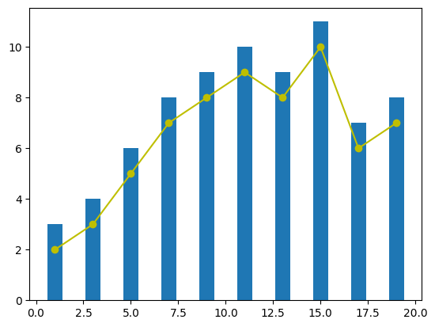
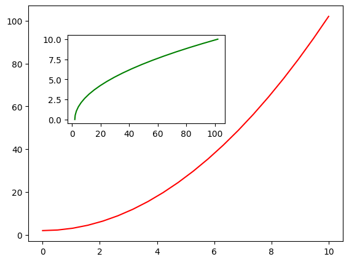
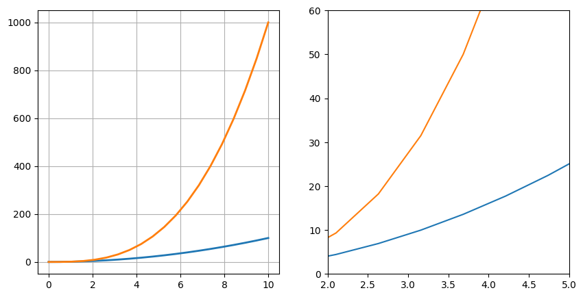
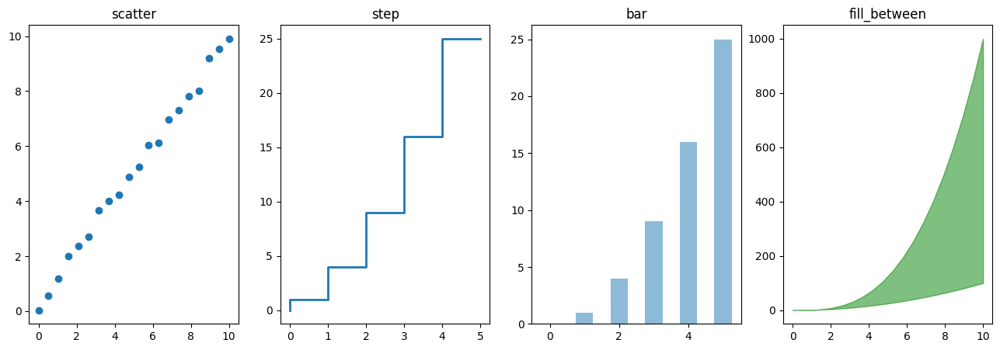
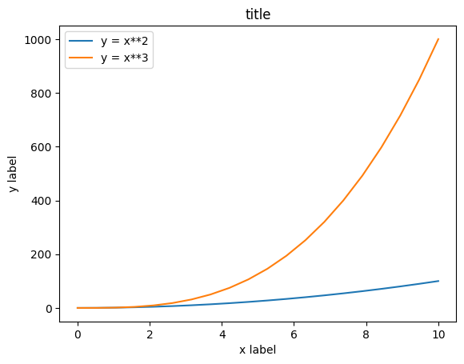

# Matplotlib

在使用机器学习方法解决问题的过程中，一定会遇到需要针对数据进行绘图的场景。Matplotlib 是支持 Python 语言的开源绘图库，因为其支持丰富的绘图类型、简单的绘图方式以及完善的接口文档，深受 Python 工程师、科研学者、数据工程师等各类人士的喜欢。Matplotlib 拥有着十分活跃的社区以及稳定的版本迭代，当我们在学习机器学习的课程时，掌握 Matplotlib 的使用无疑是最重要的准备工作之一。

在使用 Notebook 环境绘图时，需要先运行 Jupyter Notebook 的魔术命令 ** %matplotlib inline **。这条命令的作用是将 Matplotlib 绘制的图形嵌入在当前页面中。而在桌面环境中绘图时，不需要添加此命令，而是在全部绘图代码之后追加 plt.show()。

[plt 官方各种图函数手册 及 参数配置](https://matplotlib.org/3.1.0/api/pyplot_summary.html)

```
将输出图片保存
%matplotlib inline

from matplotlib import pyplot as plt
```
方法	含义
matplotlib.pyplot = plt

plt.angle_spectrum	绘制电子波谱图
plt.bar	绘制柱状图
plt.barh	绘制直方图
plt.broken_barh	绘制水平直方图
plt.contour	绘制等高线图
plt.errorbar	绘制误差线
plt.hexbin	绘制六边形图案
plt.hist	绘制柱形图
plt.hist2d	绘制水平柱状图
plt.pie	绘制饼状图
plt.quiver	绘制量场图
plt.scatter	散点图
plt.specgram	绘制光谱图

```
import numpy as np  # 载入数值计算模块

# 在 -2PI 和 2PI 之间等间距生成 1000 个值，也就是 X 坐标
X = np.linspace(-2*np.pi, 2*np.pi, 1000)
# 计算 y 坐标
y = np.sin(X)

# 向方法中 `*args` 输入 X，y 坐标
plt.plot(X, y)
```
### plt.plot 线性图
参数	含义
alpha=	设置线型的透明度，从 0.0 到 1.0
color=	设置线型的颜色
fillstyle=	设置线型的填充样式
linestyle=	设置线型的样式
linewidth=	设置线型的宽度
marker=	设置标记点的样式
### plt.scatter 散点图
参数	含义
s=	散点大小
c=	散点颜色
marker=	散点样式
cmap=	定义多类别散点的颜色
alpha=	点的透明度
edgecolors=	散点边缘颜色

### plt 将多张图组合在一起

#### 自动组合
**要求共享横坐标，才可以将图组合！**
```
x = [1, 3, 5, 7, 9, 11, 13, 15, 17, 19]
y_bar = [3, 4, 6, 8, 9, 10, 9, 11, 7, 8]
y_line = [2, 3, 5, 7, 8, 9, 8, 10, 6, 7]

plt.bar(x, y_bar)
plt.plot(x, y_line, '-o', color='y')
```


#### 画布控制组合

在 fig 画板中，可以通过 add_axes() 方法添加多个子图。
axes1  与 axes2  分别代表 大画布 与 小画布 两部分组合在一张图中

```
fig = plt.figure()  # 新建画板
axes1 = fig.add_axes([0.1, 0.1, 0.8, 0.8])  # 大画布
axes2 = fig.add_axes([0.2, 0.5, 0.4, 0.3])  # 小画布

axes1.plot(x, y, 'r')  # 大画布
axes2.plot(y, x, 'g')  # 小画布
```


```
fig, axes = plt.subplots(1, 2, figsize=(10, 5))

# 显示网格
axes[0].plot(x, x**2, x, x**3, lw=2)
axes[0].grid(True)

# 设置坐标轴范围
axes[1].plot(x, x**2, x, x**3)
axes[1].set_ylim([0, 60])
axes[1].set_xlim([2, 5])


n = np.array([0, 1, 2, 3, 4, 5])

fig, axes = plt.subplots(1, 4, figsize=(16, 5))

axes[0].scatter(x, x + 0.25*np.random.randn(len(x)))
axes[0].set_title("scatter")

axes[1].step(n, n**2, lw=2)
axes[1].set_title("step")

axes[2].bar(n, n**2, align="center", width=0.5, alpha=0.5)
axes[2].set_title("bar")

axes[3].fill_between(x, x**2, x**3, color="green", alpha=0.5)
axes[3].set_title("fill_between")

```


#### 规范绘图
```
均在一个画布中
fig, axes = plt.subplots()

axes.set_xlabel('x label')  # 横轴名称
axes.set_ylabel('y label')
axes.set_title('title')  # 图形名称

axes.plot(x, x**2)
axes.plot(x, x**3)
axes.legend(["y = x**2", "y = x**3"], loc=0)  # 图例
```

### 标注 文字、箭头
Matplotlib 中，文字标注的方法由 matplotlib.pyplot.text() 实现。最基本的样式为 matplotlib.pyplot.text(x, y, s)，其中 x, y 用于标注位置定位，s 代表标注的字符串。除此之外，你还可以通过 fontsize= , horizontalalignment= 等参数调整标注字体的大小，对齐样式等。

下面，我们举一个对柱形图进行文字标注的示例。
```
fig, axes = plt.subplots()

x_bar = [10, 20, 30, 40, 50]  # 柱形图横坐标
y_bar = [0.5, 0.6, 0.3, 0.4, 0.8]  # 柱形图纵坐标
bars = axes.bar(x_bar, y_bar, color='blue', label=x_bar, width=2)  # 绘制柱形图
for i, rect in enumerate(bars):
    x_text = rect.get_x()  # 获取柱形图横坐标
    y_text = rect.get_height() + 0.01  # 获取柱子的高度并增加 0.01
    plt.text(x_text, y_text, '%.1f' % y_bar[i])  # 标注文字
copy
```
除了文字标注之外，还可以通过 matplotlib.pyplot.annotate() 方法向图像中添加箭头等样式标注。接下来，我们向上面的例子中增添一行增加箭头标记的代码。
```
fig, axes = plt.subplots()

bars = axes.bar(x_bar, y_bar, color='blue', label=x_bar, width=2)  # 绘制柱形图
for i, rect in enumerate(bars):
    x_text = rect.get_x()  # 获取柱形图横坐标
    y_text = rect.get_height() + 0.01  # 获取柱子的高度并增加 0.01
    plt.text(x_text, y_text, '%.1f' % y_bar[i])  # 标注文字

    # 增加箭头标注
    plt.annotate('Min', xy=(32, 0.3), xytext=(36, 0.3),
                 arrowprops=dict(facecolor='black', width=1, headwidth=7))
copy
```
上面的示例中，xy=() 表示标注终点坐标，xytext=() 表示标注起点坐标。在箭头绘制的过程中，arrowprops=() 用于设置箭头样式，facecolor= 设置颜色，width= 设置箭尾宽度，headwidth= 设置箭头宽度，可以通过 arrowstyle= 改变箭头的样式。