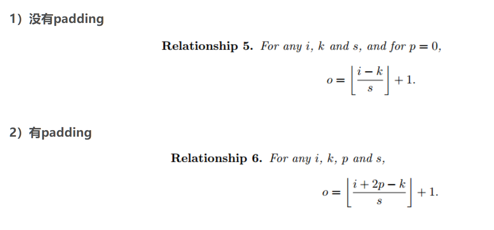
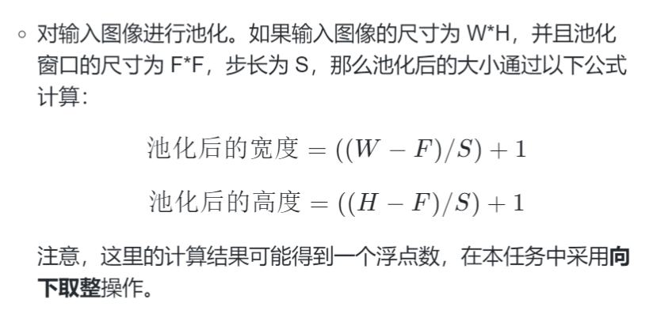

# 考点总结

[历年大学\【真题模拟 1】中文词库分词-1.ipynb] 词库中的最大匹配问题

[历年大学\【真题模拟 2】模型热更新-1.ipynb] 互斥锁、请求体、返回体、json

---

## 文件取用

### txt 文件

**分行取内容**：
extend()保持结构不变 与 append()会直接加入

- extend 拓展保持数据类型不发生改变，append 直接将变量加入其中，可能破坏数据的结构导致出错

[示例查看：历年大学\【真题模拟 7】onnx 模型量化-1.ipynb]

1.构建同义词

```python
diction ={}
with open(filepath, 'r',encoding='utf-8') as f:
    for line in f:
        line.strip() #删除回车，“str”
        words = line.strip().split('，') #删除回车，以','划分,"list"
        for word in words:
            diction[word]=words
return diction
```

2.构建词库

- set 是创建集合，集合的特点内容不重复
- & | - ^ ： 交 并 前有后无的 先并集后减去交集
- set.add() 添加单个元素
- set.upgrade( {"google", "runoob", "apple"} ) 添加多个元素

```python
    dictionary = set()
    with open('words.txt', 'r', encoding='utf-8') as f:
        for line in f:
            word = line.strip()
            dictionary.add(word)
```

### pkl 模型文件：加载与使用

- 一定是 open(modelpath,'rb') 二进制打开为 f，model = pickle.load(f)

  1.pickle：加载与推理

```python
import pickle

current_model = 'svm_1.pkl'
with open(current_model,'rb') as f:
    model = pickle.load(f)

output = model.predict(inputs)

```

2.pickle: 保存与取用

```python
写~
model = LogisticRegression()
    model.fit(x, y)

    with open(classifier_path,'wb') as file:
        pickle.dump(model, file)
读~
    with open(classifier_path, 'rb') as file:
        trained_model = pickle.load(file)
output = trained_model.predict(x_test)
```

2.torch: 加载与推理
情况 1：

- 注意，一定是使用 model.state_dict()

- 一般来说会失败，要求 svm.pkl 的内容与模型的结构完全一致

```python

torch.save(model.state_dict(), 'svm.pkl') # 也可以是'svm.pth'

model = torch.load('svm.pkl')
```

情况 2：

- 注意，一定是使用 model.state_dict()

- 可能会成功，要求 svm.pkl 的内容与模型的结构完全一致，题目中明显没有定义相关模型即废弃

```python

torch.save(model.state_dict(), 'svm.pkl') # 也可以是'svm.pth'

# 从 实例化 到 加载参数 到 load_state_dict(state_dict = )
class model_diy(model.nn)
    def ___init__(self):
        super(model_diy, self).__init__()

    def forward(self, input):

model_object = model_diy()
state_dict = torch.load('svm.pkl')
model_object.load_state_dict(state_dict = state_dict)

# 也可 model_object.load_state_dict(torch.load('svm.pkl'))
```

### csv 文件

pd.read_csv(csv_path)
使用 sum 统计数目 sum((y_test==1)&(y_pred==1))

```python
import pandas as pd
from sklearn.model_selection import train_test_split
from sklearn.svm import SVC
import numpy as np

def standardization(X):
    mean = X.mean(axis=0)
    std = X.std(axis=0)
    X = (X-mean)/std
    return X

def f1_score(y_test, y_pred):
    #TODO
    true_positives = sum((y_test == 1) & (y_pred == 1))
    false_positives = sum((y_test == 0) & (y_pred == 1))
    false_negatives = sum((y_test == 1) & (y_pred == 0))

    precision = true_positives / (true_positives + false_positives) if (true_positives + false_positives) else 0
    recall = true_positives / (true_positives + false_negatives) if (true_positives + false_negatives) else 0

    f1 = 2 * (precision * recall) / (precision + recall) if (precision + recall) else 0
    return f1

def train():
    file_path ='xx.csv'
    data = pd.read_csv(file_path)
    X = data.drop('target',axis=1).values
    y = data['target'.values]
    X = standardization(X)
    X_train, X_test, y_train, y_test =tran_test_split(X, y,test_size=0.2, random_state=42)
    model = SVC()
    model.fit(X_train, y_train)

    y_pred = model.predict()
    return (X_train, X_test),(y_train, y_test),y_pred,model
```

### torch 权重

加载 torch 模型权重，并且推理与平均计时

```python
import torch
import torch.utils.benchmark as benchmark
import torchvision.models as modes

def resnet_predict_time(input, model_path, n):
    # 加载 ResNet-18 模型
    resnet_model = models.resnet18()
    resnet_model.load_state_dict(torch.load(model_path))
    resnet_model.eval()
    resnew_bm =benchmark.Timer(stmt='resnet_model(input)',globals={'resnet_model':resnet_model,'input':input})
    # 预测 n 次的平均时间
    resnet_time = resnet_bm.timeit(n).mean
    return resnet_time
```

### onnx 模型

加载.onnx 模型权重，并推理与计时

onnxruntime 推理的输入是{}
神奇的是：onnx.load(onnx_model_path)的方式无法推理，同 torch.load(onnx_model_path) 只是模型权重本身无法推理

- onnx: 需要使用 onnxruntime ,onnxruntime.InferenceSession(model_path)

- torch:使用实例化的模型, model.load_state_dict(state_dict=state_dict)

直接加载有什么用：检查

```python
onnx_model = onnx.load(xxxx.onnx")
onnx.checker.check_model(onnx_model)
```

<mark> 标记 </mark>

1 计时器引入

```python
import torch.utils.benchmark as benchmark
import onnxruntime

def reset_predict_time(input, model_path, n):
    ort_session = onnxruntime.InferenceSession(model_path)
    onnx_inputs = {ort_session.get_inputs()[0].name:input.numpy()}

    onnx_bm = benchmark.Timer(stmt='ort_session.run(None,onnx_inputs)',globals={'ort_session':ort_session,'onnx_inputs':onnx_inputs})
    onnx_tm = onnx_bm.timeit(n).mean
    return onnx_tm
```

2 不引入计时器

```python
import pickle
import numpy as np
import onnxruntime as ort

images, labels = pickle.load(open('image_data.pkl', 'rb'))
print(len(images), len(labels))
# 100 100
session = ort.InferenceSession("inference_model.onnx")
output = session.run(None, {'input': images[0]})[0]
print(output.shape, np.argmax(output), labels[0])
# (1, 1000) 1 1

output = session.run(None, {'input': np.concatenate(images[0:10])})[0]
print(output.shape, np.argmax(output, axis=1), labels[0:10])
# (10, 1000) [1 1 1 1 1 1 1 1 1 1] [1, 1, 1, 1, 1, 1, 1, 1, 1, 1]

```

### tensorflow 模型

加载 tensorflow 模型与推理

推理使用的是 predict(),同 pickle 加载的 sklearn 模型

```python
from tensorflow.keras.model import load_model

tensorflow_model = load_model('lm.h5')

start_text = '今天，我很想'
generated_text = tensorflow_model.predict(start_text)
```

文本生成模型，包含： 输入文本（word2idx）转 idx, idx 作为推理输入，生成输出的 key_idx，经(idx2word)转 word，将 word 增加到生成输出后，将 key_idx np.append 在 idx 之后，继续推理，但是祛除第一位的元素,循环步骤

~~在我看来： 对 input_seq[1:]的操作因人而异，不一定如此 。。。错误的~~

**为什么必须去掉第一个元素？**

- 如果不删除第一个元素，序列长度会不断增长，这与模型训练时的固定长度输入不符

- 这类似于"滑动窗口"或"先进先出"(FIFO)的队列机制

```python
def generate_text(start_sequence, max_length):
    # 加载训练好的语言模型
    model = load_model("lm.h5")
    # 加载词汇表和索引转换字典
    with open("vocab.json", 'r', encoding='utf-8') as f:
        vocab_data = json.load(f)
        word_to_idx = vocab_data['word_to_idx']
        idx_to_word = vocab_data['idx_to_word']
    generated_text = start_sequence
    input_seq = [word_to_idx[word] for word in generated_text.split()]
    input_seq = np.array(input_seq).reshape(1,-1)

    for _ in range(max_length):
        pre_idx = model.predict(input_seq)
        key_idx = np.argmax(pre_idx)
        key_word = idx_wo_word[str(key_idx)]
        generated_text += ' ' + ket_word
        input_seq = np.append(input_seq, key_idx)
        input_seq =input_seq[1：].reshape(1,-1)

    generate_index = [word_to_id[word] for word in generate_text.split()]

    return generate_index
```

### gensim 模型

训练与 torch 相同

```python
from gensim.models import Word2Vec
def train_w2v_model(train_data, model_path="./word2vec_model.bin"):
    #TODO
    model = Word2Vec(train_data, vector_size=100, window=5, min_count=1, workers=4)
    model.save(model_path)
# 词库
def calculate_similarity(word1, word2, model_path="./word2vec_model.bin"):
    #TODO
    model = Word2Vec.load(model_path)
    if word1 not in model.wv.key_to_index or word2 not in model.wv.key_to_index:
        return None
    similarity = model.wv.similarity(word1, word2)
    return similarity
```

## 数学计算实现

### numpy

import numpy as np

- 平均数
  np.mean(axis=-1) -1 是最后一维
- 标准差
  np.std(axis=-1)
- 方差
  np.var(axis=-1)

### 范数

### 关于统计的频率的计算

从 words 中采集各种词的频率
与总词数

corpus 是由句子构成的总句子 list，在总句子中统计词频率
与总句子数

```python
def calc_tfidf(words, corpus):
    #TODO
    word_counter = Counter(words)
    tfidf = {}
    total_docs = len(corpus)
    for word in set(words):
        tf = word_counter[word]/len(words)
        doc_count = 0
        for doc in corpus:
            if word in doc:
                doc_count += 1
        idf = math.log(total_docs/(doc_count+1))
        tfidf[wrod] = tf * idf
    return tfidf
```

### 矩阵

### 普通 np 实现，以 ndarray 代图片

对于 index 可大胆的使用 np.range() 【左闭右开】

1.缩放/插值

```python
old_weight, old_width = image.shape

# 先计算尺寸变化比例
width_scale = new_width/old_width
weight_scale = new_weight/old_weight

# 创新的图像
new_image = np.empty((new_height, new_width),dtype = np.uint8)
# 映射关系实现
for i in range(new_height):
    for j in range(new_width):
        raw_height_postion = int(i / height_scale)
        raw_width_postion = int(j / width_scale)

        new_image[i,j] = image[raw_height_postion,raw_width_postion]
```

2.卷积操作,滤波
k 是卷积大小
s 是卷积步长
p 是 是否 padding,是为 1


```python
old_height, old_width = image.shape

new_image = np.zeros(image.shape)
edge = int((kernel_size - 1) / 2)

for i in range(old_height):
    for j in range(old_width):

        element = 0
        no_noneNum = 0
        for x in range(-edge, edge + 1, 1):
            for y in range(-edge, edge + 1, 1):
                if(0 <= (i+x) < old_height) and (0 <= (j+y) <old_width):
                    new_element = image[i+x,j+y]
                    no_noneNum += 1
                else:
                    new_element = 0

                element += new_element
        new_image[i,j] = element / no_noneNum

return new_image
```

3.池化

池化与卷积之间存在差异，通常使用的是不改变形状的卷积，池化是专门修改尺寸的

池化也有池化核，F
池化的步长对尺寸影响更大，S
公式计算后对其向下取整

```python
def average_pooling(image, pool_size, stride):
    # 原图尺寸
    raw_height ,raw_width  = image.shape
    # print(image.shape)
    # 池化尺寸
    filter_height , filter_width = pool_size
    # 池化后的尺寸
    filted_width = int((raw_width - filter_width)/stride + 1)
    filted_height = int((raw_height - filter_height)/stride + 1)
    # print(filted_height,filted_width)
    # 初始化
    pooled_image = np.zeros((filted_height,filted_width))

    for  i in range(filter_height):
        for j in range(filted_width):
            startindex_i = i * filter_height
            endindex_i = startindex_i + filter_height
            # print(startindex_i,endindex_i)
            startindex_j = j * filter_width
            endindex_j = startindex_j + filter_width

            pooled_image[i,j] = np.mean(image[startindex_i:endindex_i,startindex_j:endindex_j])
            # 最大池化
            # polled_image[i,j] = np.max(image[startindex_i:endindex_i,startindex_j:endindex_j])

    return pooled_image
```

## 模型定义/转换/训练/选择/量化

### 定义

1.teacher/student

```python

class TeacherModel(nn.model):
    def __init__(self):
        super(TeacherModel, self).__init__():
        self.model = nn.Sequential(
            nn.Linear(784, 512),
            nn.Relu(),
            nn.Linear(512, 256),
            nn.Relu(),
            nn.Linear(256, 128),
            nn.Relu(),
            nn.Linear(256, 10)
            nn.softmax(dim = 1 )
        )

    def forward(self, x):
        return self.model(x)

class StudentModel(nn.Module):
    def __init__(self):
        super(StudentModel, self).__init__()
        self.model = nn.Sequential(
        #TODO
        nn.Linear(784, 512),
            nn.ReLU(),
            nn.Linear(512, 10),
            nn.Softmax(dim=1)
        )

    def forward(self, x):
        return self.model(x)

def train_teacher(model, optimizer, citerion,train_loader):
    model.train()
    for images, labels in train_loader:
        optimizer.zero_grad()
        output = model(images.view(image.size(0),-1))
        loss = citerion(output, labels)

        loss.backard()
        optimizer.step()

def train_student(teacher_model, student_model,optimizer, critertion, distillation_loss,train_loader, model_path='./student_model.pth'):
    teacher_model.eval()
    student.model.train()
    for images,labels in train_loader:

        optimizer.zero_grad()
        teacher_output = teacher_model(images.view(images.size(0), -1)).detach()

        student_output = student_model(images.view(images.size(0), -1))
        loss = criterion(student_output, labels) + 0.5 * distillation_loss(student_output, teacher_output)
        loss.backard()
        optimizer.step()

    torch.save(student_model.state_dict(),model_path)
```

### 转换

1. torchvision.models 库中的 resnet18
   加载 pth state_dict，转化为 onnx

要素：
转换前，先设置为 model.eval() 评估模式
转换时，onnx 的转换是具体的，需要一个 input
so: torch.onnx.export(model,input,out_model_path)

```python
import torchvision
import torchvision.models as models

def onnx_model_transfer(input, input_model_path, out_model_path):
    resnet_model =models.resnet18()
    state_dict = torch.load(input_model_path)
    resnet_model.load_state_dict(state_dict = state_dict)

    # 转换前 要素：转为 eval
    resnet_model.eval()
    torch.onnx.export(resnet_model,input, out_model_path)
```

### 训练

不同于 sklearn 的 fit(X_train, y_train)
torch 模型的训练存在基本规律
梯度置零 optimizer.zero_grad() ， 正向输出 model() ，将输出 output 与 lables 比对得到 loss , loss.backard(),optimizer.step()

```pyhton

model.train()
    for images, labels in train_loader:
        optimizer.zero_grad()
        output = model(images.view(image.size(0),-1))
        loss = citerion(output, labels)

        loss.backard()
        optimizer.step()

```

### 选择

1.sklearn 库，分类模型

- sklearn.tree 单颗树 DecsionClassifier
- sklearn.ensemble 森林 RandomForestClassifier,ExtraTreeClassifier,AdaBoostClassifier
- sklearn.SVM 支持向量机 SVC,NuSVC
- sklearn.neighbors 近邻 KNeighborsClassifier
- sklearn.naive_bayes 朴素贝叶斯 GaussianNB
- sklearn.discriminant_analysis LinearDiscriminantAnalysis
- sklearn.neural_newwork 神经网路 MLPClassifier

```python
import pickle

from sklearn.neural_network import MLPClassifier
from sklearn.ensemble import AdaBoostClassifier, RandomForestClassifier, ExtraTreesClassifier
from sklearn.svm import SVC, NuSVC
from sklearn.discriminant_analysis import LinearDiscriminantAnalysis
from sklearn.neighbors import KNeighborsClassifier
from sklearn.naive_bayes import GaussianNB
from sklearn.tree import DecisionTreeClassifier
from sklearn.model_selection import train_test_split
from sklearn.metrics import accuracy_score

SEED = 42

with open('train_data.pkl', 'rb') as f:
    X, y = pickle.load(f)
X_train, X_test, y_train, y_test = train_test_split(
    X, y, test_size=0.5, random_state=SEED)


def init_models():

    classifiers = [
        SVC(random_state=SEED),
        ExtraTreesClassifier(random_state=SEED),
        LinearDiscriminantAnalysis(),
        DecisionTreeClassifier(random_state=SEED),
        KNeighborsClassifier(),
        RandomForestClassifier(random_state=SEED),
        MLPClassifier(random_state=SEED),
        AdaBoostClassifier(random_state=SEED),
        NuSVC(random_state=SEED),
        GaussianNB()
    ]

    return classifiers

def sort_models(models):
    performance = []
    for model in models:
        model.fit(X_train, y_train)
        y_pred = model.predict(x_test)
        acc = accuracy_score(y_test, y_pred)

        performance.append({'model':model,'accuracy':acc})

    sort_model = sort(performance, key = lambda x :x['accuracy', reverse = True])

    return sort_model
```

sklearn 训练与检测全流程

```python
import jieba
import pandas as pd
import pickle
from sklearn.feature_extraction.text import TfidfVectorizer
from sklearn.naive_bayes import MultinomialNB
from sklearn.linear_model import LogisticRegression
from sklearn.discriminant_analysis import LinearDiscriminantAnalysis
from sklearn.ensemble import RandomForestClassifier
from sklearn.ensemble import GradientBoostingClassifier
from sklearn.neural_network import MLPClassifier
from sklearn.svm import SVC
from sklearn.metrics import accuracy_score

def load_dataset(file_path):
    x, y = [], []
    with open(file_path, "r", encoding='utf-8') as f:
        for i in f.readlines():
            i_list = i.strip().split(",")
            x.append(i_list[2])
            y.append(int(i_list[1]))
    return x, y

def preprocess_text(text):
    words = jieba.lcut(text)
    processed_text = " ".join(words)
    return processed_text

def fit_classifier(x, y, classifier_path='./classifier_model.pkl'):
    classifier = MultinomialNB()
    classifier.fit(x, y)
    with open(classifier_path, 'wb') as file:
        pickle.dump(classifier, file)

def test_classifier(test_x, test_y, classifier_path='./classifier_model.pkl'):
    with open(classifier_path, 'rb') as file:
        classifier = pickle.load(file)
    predictions = classifier.predict(test_x)
    accuracy = accuracy_score(test_y, predictions)
    return accuracy

def main():
    train_x, train_y = load_dataset('sentiment_analysis_train.txt')
    test_x, test_y = load_dataset('sentiment_analysis_test.txt')
    train_x = [preprocess_text(text) for text in train_x]
    test_x = [preprocess_text(text) for text in test_x]

    vectorizer = TfidfVectorizer(max_features=1000)
    train_x_features = vectorizer.fit_transform(train_x)
    test_x_features = vectorizer.transform(test_x)

    fit_classifier(train_x_features, train_y)
    acc = test_classifier(test_x_features, test_y)
    print("Accuracy:", acc)

if __name__ == '__main__':
    main()
```

### 量化

量化 兼 分批次训练

from onnxruntime.quantization import quantize_dynamic, QuantType

```python
import os
import onnxruntime as ort
from flask import Flask, request, jsonify
import numpy as np
import onnx

from onnxruntime.quantization import quantize_dynamic, QuantType

app = Flask(__name__)

if os.path.isfile('inference_model_quantized.onnx'):
    session = ort.InferenceSession("inference_model_quantized.onnx")
else:
    session = ort.InferenceSession("inference_model.onnx")

def quantize_model(model_input='inference_model.onnx', model_output="inference_model_quantized.onnx"):
    #TODO
    quantize_dynamic(model_input=model_input, model_output=model_output,optimize_model=True,weight_type=QuantType.QUInt8)


def inference(data, batch_size):
    input_data = np.array(data).astype(np.float32)
    #TODO
    output = []

    for i in range(0, len(input_data), batch_size):
        batch_data = input_data[i: i+batch_size]
        batch_output = session.run(None,{'input':batch_data})[0]
        output.extend(batch_output.tolist())

    return output

@app.route('/', methods=['POST'])
def main():
    input_data = request.get_json()['input']
    output = inference(input_data, batch_size=10)
    return jsonify({'output': output})


if __name__ == '__main__':
    quantize_model()
    app.run(port=8080)

```

## 部署/后端 flask

### lock()互斥锁

引入 from threading import Lock

- 先实例化，mylock = Lock()
- 在互斥操作前，使用 with mylock:

numpy 转为 list ,tolist()

```python
# 引入
from threading import Lock
import pickle

# 实例化Lock
mylock = Lock()

@app.route('/predict', methods=['POST'])
def predict():
    with model_lock:
        inputs = request.get_json()['input']
        output = model.predict(inputs).tolist()

        return jsonify({'current_model':current_model, 'output': output})

@app.route('/update', methods=['POST'])
def update():
    with model_lock:
        new_model = request.get_json()['model']
        if new_model in ['svm_1.pkl', 'svm_2.pkl', 'svm_3.pkl']:
            global current_model, model
            current_model = new_model
            with open(current_model, 'rb') as f:
                model = pickle.load(f)
            return current_model, 200

        return 'Invalid model', 400

```

### 请求与返回体 json

request.getdata() 与 request.json()

前者直接将字节流读取，同时是未编码状态

```python
data_byte = request.getdata()
data_byte.decode('utf-8') # 使用'utf-8'解码
```

后者将返回体 json 转化为 python 的字典

```python
data_dict = request.getjson()
max_length = data_dict['max_length']
```

请求体：

```python
@app.route('/search', methods=['POST'])
def search():
    data = request.get_json()
    start_sequence = data['start_sequence']
    max_length = data['max_length']  # 从请求的 JSON 数据中获取 max_length 值
    generated_text = generate_text(start_sequence, max_length)
    return jsonify(text=generated_text)
```

返回体：

```python
from falsk import Falsk, request, jsonify

    return jsonify({'current_model':current_model, 'output':output})
    # 化字典为json

    return current_model, 200
    return current_model, 400

```

## jieba 分词 将句子分为词

注意 jieba 仅使用于中文分词！
jieba.cut 与 jieba.lcut 功能及使用完全一致，只是返回不同。
lcut() 返回的是 List 列表，cut 返回的是一个生成器，但是通过 print(jieba.cut(sentence)),会发现与 lcut 直接输出一样

- 三种模式（不重要）以 lcut 为例
  全模式
  data = jieba.lcut(sentence,cut_all = Frue)
  精准模式
  data = jieba.lcut(sentence,cut_all = False)
  搜索引擎方式
  data = jieba.lcut_for_search(sentence)

让 List 中的词之间用空格连接，
list_div = " ".join(List)

## word2idx 将词变为数字 嵌入

中文嵌入与英文嵌入是相同的:

```python
def tokens_to_ids(tokens, word2id, max_len=10, unk='<unk>', pad='<pad>'):
    ids = []

    for token in tokens:
        if token in word2id:
            ids.append(word2id[token])
        else:
            ids.append(word2id[unk])

    if len(ids) >= max_len:
        ids = ids[:max_len]
    else:
        while len(ids) < max_len:
            ids.append(word2id[pad])

    # if len(ids) < max_len:
    #     # 如果列表长度小于 max_len，用 <pad> 的 id 进行填充
    #     ids += [word2id[pad]] * (max_len - len(ids))
    # else:
    #     # 如果列表长度大于等于 max_len，则截断为 max_len 长度
    #     ids = ids[:max_len]

    return ids
```

## sklearn 分词器 vectorizer

对于分词器的加载，以及使用 transform

```python
import numpy as np
import tensorflow as tf
import pickle
import jieba

def text_to_sequence(text):
    #TODO
    with open('vectorizer.pkl', 'rb') as file:
        vectorizer = pickle.load(file)
        vocab = vectorizer.vocabulary_
    word2idx = {word: idx for idx, word in enumerate(vocab)}

    words = jieba.lcut(text)  # 使用jieba进行中文分词处理
    seq = [word2idx.get(word, 0) for word in words]  # 使用get方法获取索引，不存在的词使用0表示
    seq2 = seq[:100] + [0] * (100 - len(seq))  # 填充到固定长度
    seq3 = seq[:50] + [0] * (50 - len(seq))  # 填充到固定长度
    seq1 = vectorizer.transform([' '.join(words)])
    return seq1, seq2, seq3

def predict_text(seq1, seq2, seq3):
    #TODO
    # 加载分类模型1
    with open('classifier_model1.pkl', 'rb') as file:
        classifier1 = pickle.load(file)
    # 加载分类模型2
    classifier2 = tf.keras.models.load_model('classifier_model2.h5')
    # 加载分类模型3
    classifier3 = tf.keras.models.load_model('classifier_model3.h5')

    pred1 = classifier1.predict(seq1)[0] # 获取类别为1的概率值

    sequence2 = np.array([seq2])
    pred2 = int(classifier2.predict(sequence2)[0][0]>= 0.5)
    sequence3 = np.array([seq3])
    pred3 = int(classifier3.predict(sequence3)[0][0]>= 0.5)
    print(pred1,pred2,pred3)
    votes = [pred1, pred2, pred3]
    ensemble_pred = int(sum(votes) >= 2)  # 投票法，判定为1的个数大于等于2则预测为1，否则预测为0

    return ensemble_pred

def main():
    input_text = "自由多么快乐."
    seq1, seq2, seq3 = text_to_sequence(input_text)
    prediction = predict_text(seq1, seq2, seq3)
    print(f"Prediction: {prediction}")

if __name__ == '__main__':
    main()
```

## emmbedding
