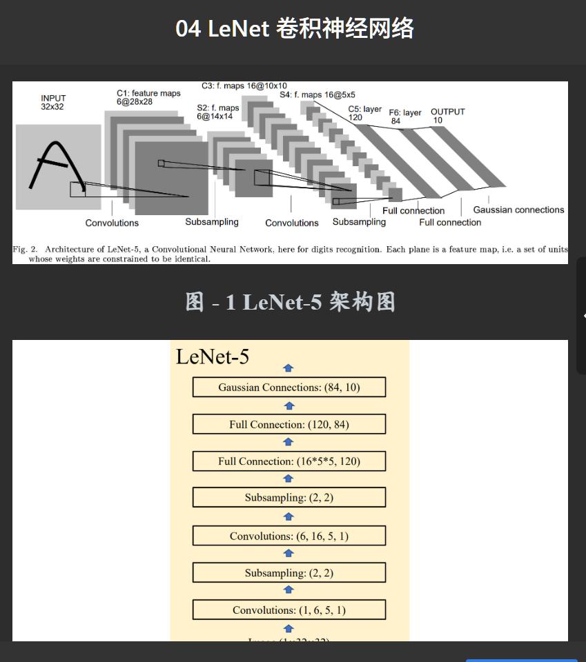
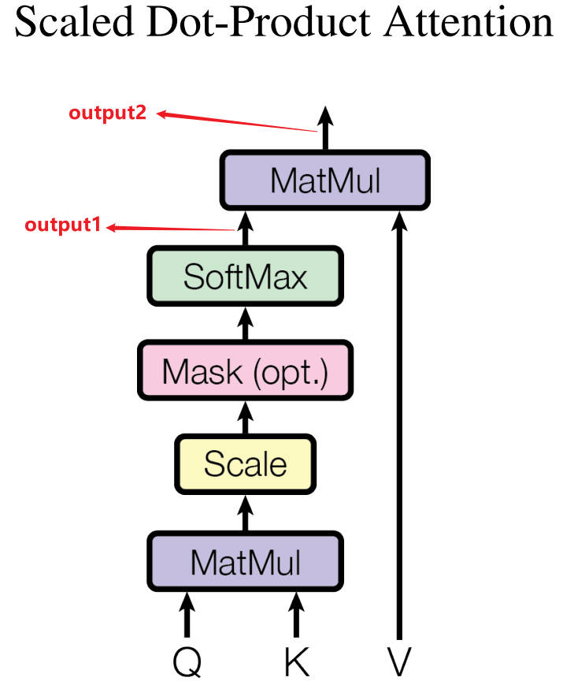

```python
1
import numpy as np

def layer_norm(X: np.ndarray, epsilon: float=1e-5)->np.ndarray:
    # TODO
    mean = np.mean(X, axis= -1, keepdims=True)
    variance = np.var(X, axis= -1, keepdims=True)

    norm = (X - mean) / np.sqrt(variance + epsilon)

    return norm

if __name__ == '__main__':
    # 输入示例
    X = np.random.rand(16, 196, 768)
    epsilon = 1e-5
    # 层归一化
    Y = layer_norm(X, epsilon)
    print(Y) # 经过层归一化处理后，Y 最后一个维度的均值为 0，方差为 1（误差在 1e-3 范围内均视为正确答案）。

2
import os
import csv
import pandas as pd
from typing import List, Tuple
from bs4 import BeautifulSoup

def parse_index_page(index_path: str) -> List[str]:
    with open(index_path, 'r', encoding='utf-8') as file:
        soup = BeautifulSoup(file, 'html.parser')
    category_links = []
    for link in soup.find_all('a'):
        href = link.get('href')
        if href and href.endswith('.html') and href != 'index.html':
            category_links.append(href)
    return category_links

def parse_category_page(category_page_path: str, html_dir: str) -> List[str]:
    with open(category_page_path, 'r', encoding='utf-8') as file:
        soup = BeautifulSoup(file, 'html.parser')
    movie_links = []
    for link in soup.find_all('a'):
        href = link.get('href')
        if href and href.endswith('.html') and href != 'index.html':
            movie_links.append(os.path.join(html_dir, href))
    return movie_links

def parse_movie_page(movie_page_path: str) -> Tuple[str, str, str, str]:
    with open(movie_page_path, 'r', encoding='utf-8') as file:
        soup = BeautifulSoup(file, 'html.parser')
    title = soup.find('h1').text.strip()
    summary = soup.find('div', class_='summary').text.strip()
    genre = soup.find('span', class_='genre').text.strip()
    year = soup.find('span', class_='year').text.strip()
    return (title, summary, genre, year)

def save_to_csv(movie_data: List[Tuple[str, str, str, str]], output_csv: str) -> None:
    with open(output_csv, 'w', newline='', encoding='utf-8') as file:
        writer = csv.writer(file)
        writer.writerow(['titles', 'summary', 'genre', 'year'])
        for data in movie_data:
            writer.writerow(data)

def main(html_dir: str, output_csv: str) -> None:
    index_path = os.path.join(html_dir, 'index.html')

    category_pages = parse_index_page(index_path)
    print(f'{category_pages[:3]=}')
    movie_data = []

    for i, category_filename in enumerate(category_pages):
        category_page_path = os.path.join(html_dir, category_filename)

        movie_pages = parse_category_page(category_page_path, html_dir)
        if i == 0:
            print(f"{category_page_path=}, {movie_pages[:3]=}")
        for j, movie_page_path in enumerate(movie_pages):
            movie_info = parse_movie_page(movie_page_path)
            if i == 0 and j ==0:
                print(movie_info)
            movie_data.append(movie_info)

    save_to_csv(movie_data, output_csv)


if __name__ == "__main__":
    html_dir = 'html_pages'
    output_csv = 'imdb_extracted.csv'

    main(html_dir, output_csv)

3
from PIL import Image
from torch import Tensor
import numpy as np
from torchvision import transforms

def load_image(file_path: str)->Tensor:
    #TODO
    file_path = '/home/project/03/img.jpg'
    image = Image.open(file_path)
    image = image.convert("RGB")
    transform =transforms.ToTensor()

    tensor_image = transform(image)
    print(type(tensor_image))
    return tensor_image
if __name__ == '__main__':
    file_path = 'img.jpg'
    img = load_image(file_path)
    print(img.shape) # torch.Size([3, 334, 500])
    print(type(img)) # <class 'torch.Tensor'>

4
import torch
import torch.nn as nn
from torch import Tensor
from typing import Tuple

class LeNet5(nn.Module):

    def __init__(self, num_classes: int = 10, in_channels: int=1, H: int=32, W: int=32)->None:
        super(LeNet5, self).__init__()
        #TODO
        # Convolutional layers
        self.conv1 = nn.Conv2d(in_channels, 6, kernel_size=5, stride=1)
        self.sigmoid1 = nn.Sigmoid()
        self.subsample1 = nn.AvgPool2d(kernel_size=2, stride=2)

        self.conv2 = nn.Conv2d(6, 16, kernel_size=5, stride=1)
        self.sigmoid2 = nn.Sigmoid()
        self.subsample2 = nn.AvgPool2d(kernel_size=2, stride=2)

        # Calculate the size after conv and pooling layers
        def calculate_conv_output_size(size, kernel_size, stride=1, padding=0):
            return (size - kernel_size + 2 * padding) // stride + 1

        def calculate_pool_output_size(size, kernel_size, stride):
            return (size - kernel_size) // stride + 1

        # Calculate feature map dimensions after each layer
        h = calculate_conv_output_size(H, 5)  # conv1
        h = calculate_pool_output_size(h, 2, 2)  # subsample1
        h = calculate_conv_output_size(h, 5)  # conv2
        h = calculate_pool_output_size(h, 2, 2)  # subsample2

        self.fc1 = nn.Linear(16 * h * h, 120)
        self.sigmoid3 = nn.Sigmoid()
        self.fc2 = nn.Linear(120, 84)
        self.sigmoid4 = nn.Sigmoid()
        self.fc3 = nn.Linear(84, num_classes)

    def forward(self, x: Tensor)->Tuple[Tensor, Tensor]:
        #TODO
        # First conv block
        x = self.conv1(x)
        x = self.sigmoid1(x)
        x = self.subsample1(x)

        # Second conv block
        x = self.conv2(x)
        x = self.sigmoid2(x)
        s4 = self.subsample2(x)

        # Flatten for fully connected layers
        x = torch.flatten(s4, 1)
        x = self.fc1(x)
        x = self.sigmoid3(x)
        x = self.fc2(x)
        x = self.sigmoid4(x)
        output = self.fc3(x)

        return s4, output

if __name__ == '__main__':
    img = torch.Tensor(8, 1, 32, 32)
    lenet5 = LeNet5(10, img.size(1), img.size(2), img.size(3))
    x, y = lenet5(img)
    print(x.shape) # torch.Size([8, 16, 5, 5])
    print(y.shape) # torch.Size([8, 10])
5
import torch
from torch import nn, Tensor
import numpy as np
from typing import Tuple

class ScaledDotProductAttention(nn.Module):
    def __init__(self):
        super(ScaledDotProductAttention, self).__init__()
        self.softmax = nn.Softmax(dim=-1)

    def forward(self, Q: Tensor, K: Tensor, V: Tensor)->Tuple[Tensor, Tensor]:
        #TODO
        # 计算Q和K的转置的点积
        matmul_qk = torch.matmul(Q, K.transpose(-2, -1))

        # 缩放点积结果
        d_k = K.size(-1)
        scaled_attention_logits = matmul_qk / torch.sqrt(torch.tensor(d_k, dtype=torch.float32))

        # 应用softmax得到注意力权重（output1）
        attention_weights = self.softmax(scaled_attention_logits)

        # 计算加权和得到最终输出（output2）
        output = torch.matmul(attention_weights, V)

        return attention_weights, output

if __name__ == '__main__':
    scaled_dot_product_attn = ScaledDotProductAttention()
    d_model = 768
    batch_size, tgt_len, src_len = 2, 10, 20
    Q, K, V = torch.rand((batch_size, tgt_len, d_model)), torch.rand((batch_size, src_len, d_model)), torch.rand((batch_size, src_len, d_model))

    output1, output2 = scaled_dot_product_attn(Q, K, V)
    print(output1.shape) # torch.Size([2, 10, 20])
    print(output2.shape) # torch.Size([2, 10, 768])

6
import torch
from torch.optim import Adam, SGD
from typing import Tuple

def rosenbrock_function(x: torch.Tensor, y: torch.Tensor, a: float=1., b: float=100.) -> torch.Tensor:
    return (a - x)**2 + b * (y - x**2)**2

def find_rosenbrock_minimum(max_iter: int) -> Tuple[float, float, float, SGD]:
    x = torch.tensor([0.0], requires_grad=True)
    y = torch.tensor([0.0], requires_grad=True)
    #TODO
    # 初始化SGD优化器，设置合适的学习率和动量
    optimizer = SGD([x, y], lr=0.001, momentum=0.9)

    for _ in range(max_iter):
        optimizer.zero_grad()  # 清除之前的梯度
        f = rosenbrock_function(x, y)  # 计算函数值
        f.backward()  # 反向传播计算梯度
        optimizer.step()  # 更新参数

    # 返回x和y的最终值，函数值以及优化器实例
    return x.item(), y.item(), f.item(), optimizer

if __name__ == "__main__":
    x_min, y_min, f_min, sgd = find_rosenbrock_minimum(max_iter=1000)
    print(f"局部最小值点：x = {x_min}, y = {y_min}, 对应的函数值：f(x, y) = {f_min}, SGD 参数：{sgd.state_dict()}")

7
import onnxruntime as ort
import numpy as np
from typing import Dict, Tuple, List
from collections import defaultdict


def group_images_by_size(images_dict: Dict[str, np.ndarray]) -> Dict[Tuple[int, int], List[Tuple[str, np.ndarray]]]:
    #TODO
    grouped = defaultdict(list)
    for name, image in images_dict.items():
        height, width, _ = image.shape
        grouped[(height, width)].append((name, image))
    return dict(grouped)


def grouped_inference(images_dict: Dict[str, np.ndarray], filename: str) -> Dict[str, np.ndarray]:
    #TODO
    grouped_images = group_images_by_size(images_dict)
    print([(size, len(images), images[0][1].shape) for size, images in grouped_images.items()])

    session = ort.InferenceSession(filename)
    input_name = session.get_inputs()[0].name
    output_name = session.get_outputs()[0].name

    results = {}
    for size, image_list in grouped_images.items():
        # Extract the images in batch
        batch = np.stack([img for _, img in image_list])
        # Run inference
        outputs = session.run([output_name], {input_name: batch})[0]
        # Map results back to their original names
        for (name, _), output in zip(image_list, outputs):
            results[name] = output
    return results


def main() -> None:
    filename = 'srcnn.onnx'
    images = {f'image{i}': np.random.random([128*(i%3+1), 128*(i%2+1), 3]).astype(np.float32) for i in range(16)}
    print([(file, image.shape) for file, image in images.items()])
    images = grouped_inference(images, filename)
    print([(file, image.shape) for file, image in images.items()])


if __name__ == '__main__':
    main()

8
import pickle
from typing import List, Tuple
import jieba
from sklearn.metrics.pairwise import cosine_similarity
import numpy as np
import onnxruntime as ort


class TextSimilarityRecommender:
    def __init__(self, model_path: str, tokenizer_path: str):
        #TODO
        # Initialize ONNX session
        self.session = ort.InferenceSession(model_path)
        # Load tokenizer
        with open(tokenizer_path, 'rb') as f:
            self.tokenizer = pickle.load(f)

    def embed_texts(self, texts: List[str]) -> np.ndarray:
        #TODO
        # Tokenize and encode texts
        encoded_inputs = self.tokenizer(texts, padding=True, truncation=True, return_tensors='np')
        # Run inference
        outputs = self.session.run(None, dict(encoded_inputs))
        # Get embeddings (assuming the first output is the embeddings)
        embeddings = outputs[0]
        # If there's a second dimension of size 1, squeeze it
        if embeddings.shape[1] == 1:
            embeddings = np.squeeze(embeddings, axis=1)
        return embeddings

    def find_most_similar(self, query: str, corpus: List[str]) -> Tuple[str, float]:
        #TODO
        # Embed both query and corpus
        query_embedding = self.embed_texts([query])
        corpus_embeddings = self.embed_texts(corpus)
        # Calculate cosine similarities
        similarities = cosine_similarity(query_embedding, corpus_embeddings)[0]
        # Find most similar
        max_idx = np.argmax(similarities)
        return corpus[max_idx], similarities[max_idx]

    def recommend(self, query: str, corpus: List[str]) -> str:
        most_similar_text, similarity = self.find_most_similar(query, corpus)
        print(f"{most_similar_text=}, {similarity=}")
        highlighted_text = highlight_similar_words(query, most_similar_text)
        return highlighted_text


def highlight_similar_words(text1: str, text2: str) -> str:
    #TODO
    # Tokenize both texts
    words1 = set(jieba.cut(text1))
    words2 = jieba.cut(text2)
    # Build highlighted text
    highlighted = []
    for word in words2:
        if word in words1:
            highlighted.append(f"<b>{word}</b>")
        else:
            highlighted.append(word)
    return ''.join(highlighted)


if __name__ == '__main__':
    recommender = TextSimilarityRecommender("embedding.onnx", "embedding.pkl")
    corpus = ["北京今日天气：阴", "蓝桥杯赛事安排"]
    query = "北京今日天气怎么样"
    recommendation = recommender.recommend(query, corpus)
    print(recommendation)

9
from typing import List
import torch
from transformers import AutoTokenizer, AutoModelWithLMHead
import onnxruntime as ort
from transformers import BertForMaskedLM
import numpy as np


def convert(model_path: str, tokenizer_path: str, onnx_path: str) -> None:
    #TODO
    # 加载模型和分词器
    tokenizer = AutoTokenizer.from_pretrained(tokenizer_path)
    model = BertForMaskedLM.from_pretrained(model_path)
    model.eval()

    # 创建虚拟输入
    inputs = tokenizer("这是一个[MASK]例子", return_tensors="pt")
    input_ids = inputs["input_ids"]
    attention_mask = inputs["attention_mask"]
    token_type_ids = inputs["token_type_ids"]

    # 定义动态轴
    dynamic_axes = {
        'input_ids': {0: 'batch', 1: 'sequence'},
        'attention_mask': {0: 'batch', 1: 'sequence'},
        'token_type_ids': {0: 'batch', 1: 'sequence'},
        'output': {0: 'batch', 1: 'sequence'}
    }

    # 导出ONNX模型
    torch.onnx.export(
        model,
        (input_ids, attention_mask, token_type_ids),
        onnx_path,
        input_names=['input_ids', 'attention_mask', 'token_type_ids'],
        output_names=['output'],
        dynamic_axes=dynamic_axes,
        opset_version=11
    )


def inference(text: str, onnx_path: str, tokenizer_path: str) -> List[str]:
    #TODO
    # 加载分词器
    tokenizer = AutoTokenizer.from_pretrained(tokenizer_path)

    # 准备输入
    inputs = tokenizer(text, return_tensors="np")
    input_ids = inputs["input_ids"]
    attention_mask = inputs["attention_mask"]
    token_type_ids = inputs["token_type_ids"]

    # 创建ONNX运行时会话
    ort_session = ort.InferenceSession(onnx_path)

    # 运行推理
    outputs = ort_session.run(
        None,
        {
            'input_ids': input_ids,
            'attention_mask': attention_mask,
            'token_type_ids': token_type_ids
        }
    )

    # 获取logits
    logits = outputs[0]

    # 找到mask的位置
    mask_token_index = np.where(input_ids == tokenizer.mask_token_id)[1]

    # 获取mask位置的logits
    mask_logits = logits[0, mask_token_index, :]

    # 获取top 5的token
    top_tokens = np.argsort(-mask_logits)[0, :5]

    # 转换为token文本
    preds = [tokenizer.decode([token]) for token in top_tokens]

    return preds


if __name__ == '__main__':
    model_path = "/home/project/09/bert-base-chinese"
    tokenizer_path = "/home/project/09/bert-base-chinese"
    onnx_path = "/home/project/09/bert_base_chinese.onnx"
    convert(model_path, tokenizer_path, onnx_path)
    text = "巴黎是 [MASK] 国的首都。"
    preds = inference(text, onnx_path, tokenizer_path)
    print(preds)
```





全是错的！
